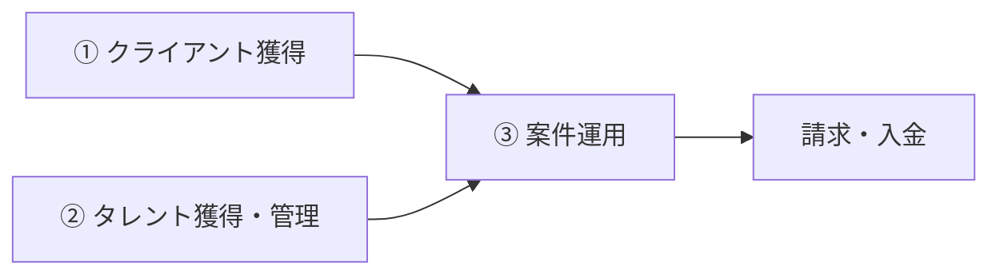
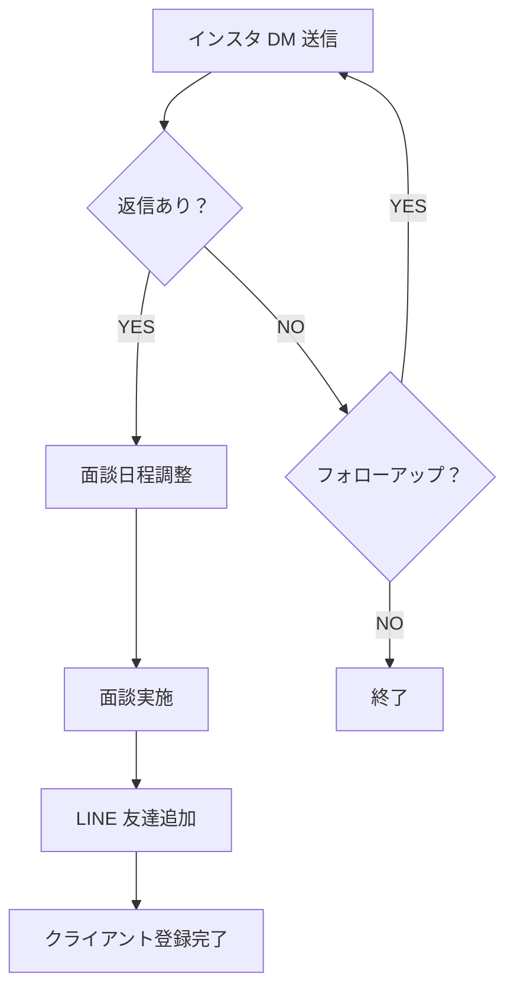
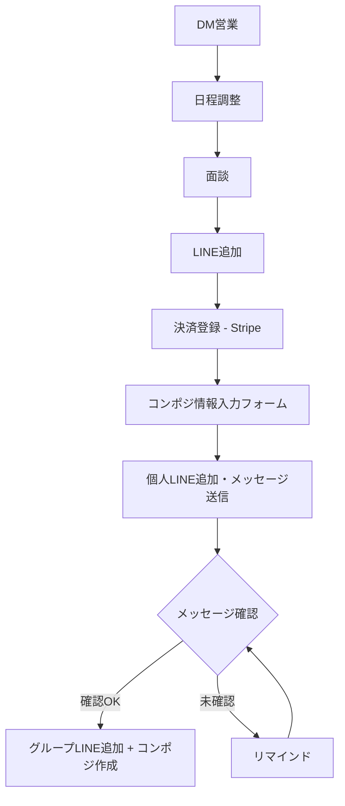
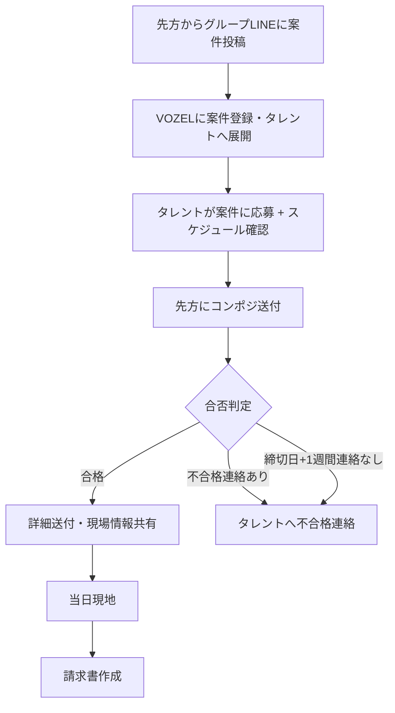

# VOZEL 業務フロー整理

## 全体像

3つの業務フローで構成される。

| フロー | 概要 | 主な対象 |
|--------|------|----------|
| ① クライアント獲得 | インスタDM → 面談 → LINE追加 | クライアント（企業） |
| ② タレント獲得・管理 | DM営業 → 面談 → 決済登録 → コンポジ作成 | タレント（個人） |
| ③ 案件運用 | 案件応募 → 合否 → 詳細送付 → 請求書作成 | クライアント × タレント |

---

## フロー① クライアント獲得（LINE登録まで）

| # | ステップ | 担当 | ツール | 備考 |
|---|----------|------|--------|------|
| 1 | インスタ DM 送信 | 自社 | Instagram | ターゲットリスト基に送信 |
| 2 | 返信確認・アポ調整 | 自社 | Instagram DM | 未返信は一定期間後フォローアップ |
| 3 | 面談実施 | 双方 | 対面 / オンライン | サービス説明・条件すり合わせ |
| 4 | LINE 友達追加 | 双方 | LINE | グループLINE招待 |

---

## フロー② タレント獲得〜管理

| # | ステップ | 担当 | ツール | VOZEL対応 | 備考 |
|---|----------|------|--------|-----------|------|
| 1 | DM営業 | 自社 | Instagram | 未対応 | ターゲットリストに基づきDM送信 |
| 2 | 日程調整 | 自社 | Instagram DM | 未対応 | 返信確認・面談日時決定 |
| 3 | 面談 | 双方 | 対面 / オンライン | 未対応 | サービス説明・条件すり合わせ |
| 4 | LINE追加 | 双方 | LINE | 未対応 | 公式LINE友達追加 |
| 5 | 決済登録 | タレント | Stripe（LINE連携） | 未対応 | サブスク決済の登録 |
| 6 | コンポジ情報入力 | タレント | 入力フォーム | 一部対応 | VOZEL上でタレント情報管理可能 |
| 7 | 個人LINE追加 | 自社 | LINE | 未対応 | 個人LINEを追加しメッセージ送信 |
| 8 | メッセージ確認 | 自社 | LINE | 未対応 | タレントがメッセージを確認したか確認 |
| 9 | グループLINE追加 + コンポジ作成 | 自社 | LINE / VOZEL | 一部対応 | 確認後にグループへ招待、コンポジ作成 |

---

## フロー③ 案件の応募〜完了

> **不合格判定ルール**: 先方から連絡がない場合、締切日から1週間経過で自動的に不合格判定とする

| # | ステップ | 担当 | ツール | VOZEL対応 | 備考 |
|---|----------|------|--------|-----------|------|
| 1 | 案件投稿受信 | 先方 | グループLINE | 未対応 | 案件内容・条件の確認 |
| 2 | 案件登録・展開 | 自社 | VOZEL | 対応済み | 案件をVOZELに登録、条件に合うタレントへ配信 |
| 3 | 案件応募 | タレント | VOZEL | 対応済み | タレントがVOZEL上で応募+ファイル添付 |
| 4 | コンポジ送付 | 自社 | VOZEL / LINE | 対応済み | 応募者のコンポジを先方へ送付 |
| 5 | スケジュール管理 | 自社 | [スプレッドシート](https://docs.google.com/spreadsheets/d/1BmV02XJRzeoPTNH5HRBr7n6BofePjEZ9qXEzXrbobHk/edit?usp=sharing) | 未対応 | スケジュール＋重複チェック |
| 6 | 合否判定 | 先方 | LINE | 未対応 | 合格→詳細送付、不合格→連絡なしの場合あり（締切日+1週間で不合格判定） |
| 7 | 詳細送付 | 自社 | LINE | 未対応 | 合格者へ現場詳細・当日の流れを連絡 |
| 8 | 当日現地 | タレント | − | − | 現場での業務遂行 |
| 9 | 請求書作成 | 自社 | ？ | 未対応 | ツール未確認 |
| 10 | 振込作業 | 自社 | 銀行 | 未対応 | 締め日・支払いサイクル要確認 |

---

## システム対応状況（VOZEL）

| カテゴリ | 機能 | 状況 | 備考 |
|----------|------|------|------|
| **タレント管理** | タレント登録・プロフィール管理 | 対応済み | アクセストークン自動生成含む |
| | コンポジ情報管理 | 対応済み | タレント詳細ページで管理 |
| | コンポジ作成・PDF出力 | 対応済み | |
| **案件管理** | 案件登録・条件設定 | 対応済み | 提出要件の設定含む |
| | 案件一覧・フィルタリング | 対応済み | 年齢/性別/身長でフィルタリング |
| | タレント向け案件表示 | 対応済み | 条件に合う案件のみ表示 |
| **応募管理** | タレントからの案件応募 | 対応済み | ファイル添付対応 |
| | 応募者一覧・管理 | 対応済み | |
| | LINE送信コピー機能 | 対応済み | 管理者向け |
| **未対応** | DM営業自動化 | 未対応 | インスタDM自動送信 |
| | 決済登録（Stripe連携） | 未対応 | サブスク管理 |
| | スケジュール管理 | 未対応 | 現状スプレッドシートで運用 |
| | 合否判定の自動化 | 未対応 | 締切日+1週間で自動不合格判定 |
| | 請求書作成 | 未対応 | ツール未確認 |

---

## 確認済み事項

| # | 項目 | 回答 |
|---|------|------|
| 1 | サブスクの支払い方法 | **Stripe**（公式LINEと連携して決済） |
| 2 | スケジュール管理スプシ | [スプシリンク](https://docs.google.com/spreadsheets/d/1BmV02XJRzeoPTNH5HRBr7n6BofePjEZ9qXEzXrbobHk/edit?usp=sharing)（スケジュール＋コンポジット情報） |
| 3 | 案件配信の対象者選定条件 | 年齢/性別/身長でフィルタリング（VOZEL対応済み） |
| 4 | タレント獲得フロー | DM営業→面談→LINE追加→決済登録→コンポジ入力→グループLINE追加 |

---

## 要確認事項

| # | 質問 | 目的 |
|---|------|------|
| 1 | 請求書発行のツールは？ | 請求フローの自動化検討のため |
| 2 | 締め日・支払いサイクルは？ | 振込作業の管理設計のため |
