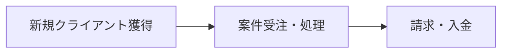
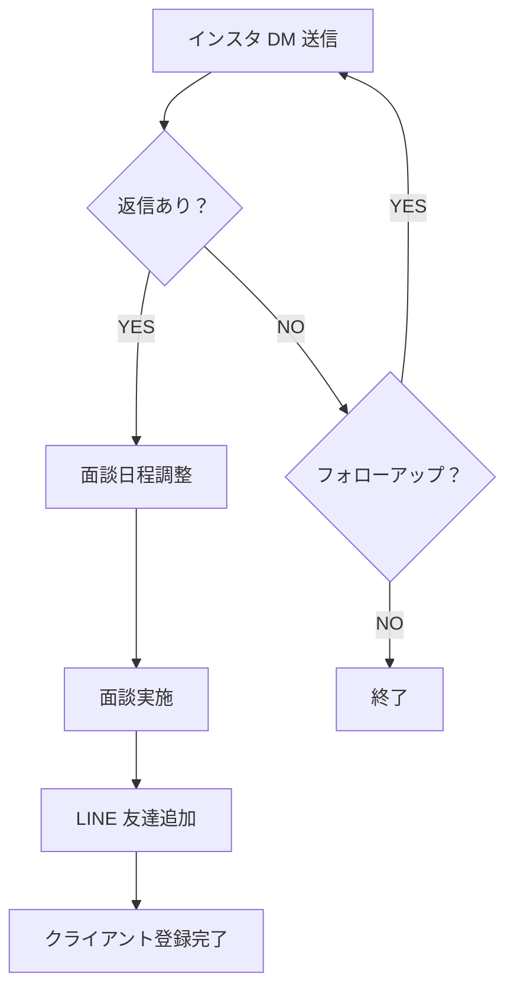
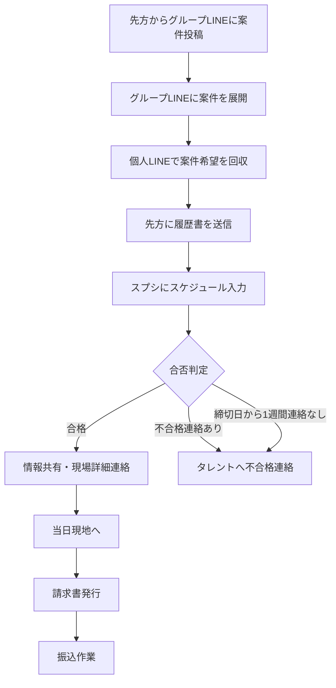

# aemi 業務フロー整理

## 全体像

---

## フロー① 新規クライアント獲得（LINE登録まで）

| #   | ステップ       | 担当  | ツール          | 備考               |
| --- | ---------- | --- | ------------ | ---------------- |
| 1   | インスタ DM 送信 | 自社  | Instagram    | ターゲットリスト基に送信     |
| 2   | 返信確認・アポ調整  | 自社  | Instagram DM | 未返信は一定期間後フォローアップ |
| 3   | 面談実施       | 双方  | 対面 / オンライン   | サービス説明・条件すり合わせ   |
| 4   | LINE 友達追加  | 双方  | LINE         | グループLINE招待       |

---

## フロー② 案件受注〜処理

> **不合格判定ルール**: 先方から連絡がない場合、締切日から1週間経過で自動的に不合格判定とする

| #   | ステップ       | 担当     | ツール         | 備考                                          |
| --- | ---------- | ------ | ----------- | ------------------------------------------- |
| 1   | 案件投稿受信     | 先方     | グループLINE    | 案件内容・条件の確認                                   |
| 2   | 案件展開       | 自社     | グループLINE    | 登録者向けに案件を共有                                  |
| 3   | 希望者回収      | 自社     | 個人LINE      | 個別に希望・可否を確認                                  |
| 4   | 履歴書送付      | 自社     | LINE / メール？ | フォーマット統一が必要？                                 |
| 5   | スケジュール入力   | 自社     | [スプレッドシート](https://docs.google.com/spreadsheets/d/1BmV02XJRzeoPTNH5HRBr7n6BofePjEZ9qXEzXrbobHk/edit?usp=sharing) | スケジュール管理＋履歴書(コンポジット)情報 |
| 6   | 合否判定       | 先方     | LINE        | 合格→情報共有、不合格→連絡なしの場合あり（締切日+1週間で不合格判定）        |
| 7   | 情報共有       | 自社     | LINE        | 合格者へ現場詳細・当日の流れを連絡                            |
| 8   | 当日現地       | タレント   | −           | 現場での業務遂行                                     |
| 9   | 請求書発行      | 自社     | ？           | ツール未確認                                       |
| 10  | 振込作業       | 自社     | 銀行          | 締め日・支払いサイクル要確認                                |

---

## DX（業務自動化）の提案

### 1. 案件配信の自動化
- 先方からグループLINEに案件が投稿されたら、登録者へ**自動で案件を配信**する
- **年齢/性別/身長でフィルタリング**して、タレント側に合った案件のみ表示する

### 2. 案件申込時の自動処理
案件の申し込みがあった際に、以下2つを自動化：

| # | 自動化内容 | 現状 | 効果 |
|---|----------|------|------|
| 1 | avex向け提出資料（履歴書等）の自動生成 | 手動で作成・送付 | 作業時間削減・フォーマット統一 |
| 2 | スケジュール管理表への自動記録 + 重複アラート | 手動でスプシ入力 | 入力漏れ防止・ダブルブッキング防止 |

### 3. インスタDM自動送信
- ターゲットリストに基づきDMを自動送信
- フォローアップDMの自動リマインドも検討

### 4. 合否判定の自動化
- 締切日から1週間連絡がない場合、自動で不合格判定→タレントへ通知

---

## 確認済み事項

| # | 項目 | 回答 |
|---|------|------|
| 1 | サブスクの支払い方法 | **Stripe**（公式LINEと連携して決済） |
| 2 | スケジュール管理スプシ | [スプシリンク](https://docs.google.com/spreadsheets/d/1BmV02XJRzeoPTNH5HRBr7n6BofePjEZ9qXEzXrbobHk/edit?usp=sharing)（スケジュール＋履歴書/コンポジット情報） |
| 3 | 案件配信の対象者選定条件 | 現状は全員に全案件公開。年齢/性別/身長でフィルタリングすると効果的 |

---

## 要確認事項

| # | 質問 | 目的 |
|---|------|------|
| 1 | avexへの提出資料のフォーマット・必須項目は？ | 資料自動生成の仕様策定のため |
| 2 | 請求書発行のツールは？ | 請求フローの自動化検討のため |
| 3 | 締め日・支払いサイクルは？ | 振込作業の管理設計のため |
