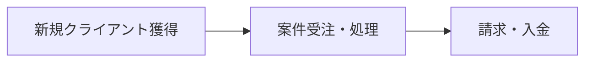
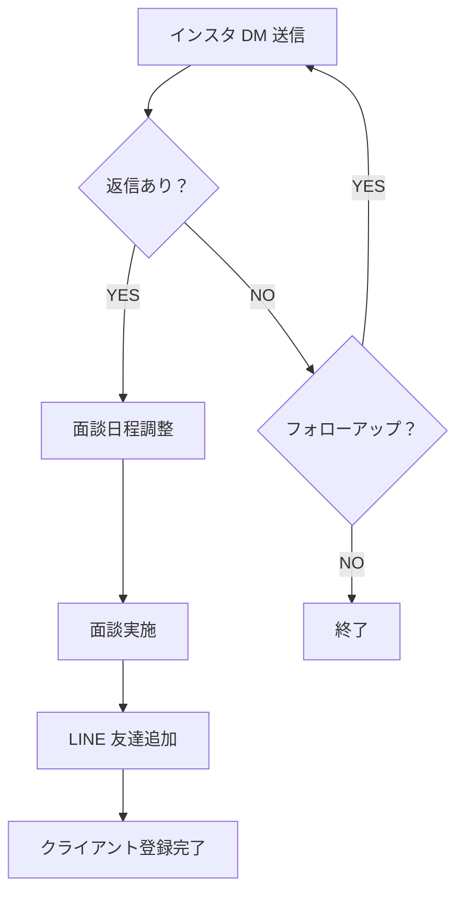
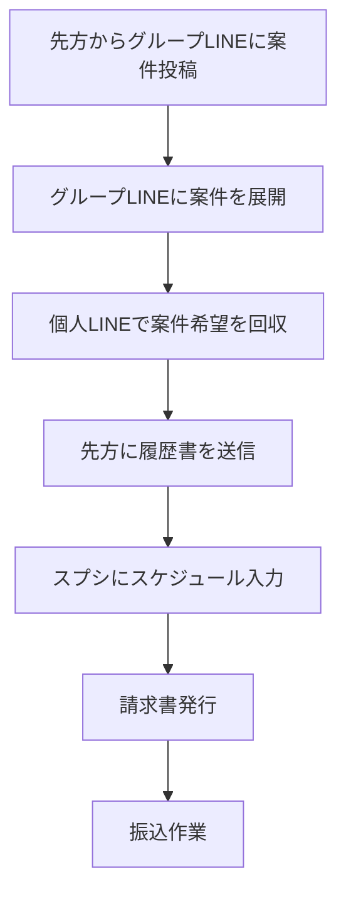

# aemi 業務フロー整理

## 全体像

---

## フロー① 新規クライアント獲得（LINE登録まで）

| #   | ステップ       | 担当  | ツール          | 備考               |
| --- | ---------- | --- | ------------ | ---------------- |
| 1   | インスタ DM 送信 | 自社  | Instagram    | ターゲットリスト基に送信     |
| 2   | 返信確認・アポ調整  | 自社  | Instagram DM | 未返信は一定期間後フォローアップ |
| 3   | 面談実施       | 双方  | 対面 / オンライン   | サービス説明・条件すり合わせ   |
| 4   | LINE 友達追加  | 双方  | LINE         | グループLINE招待       |

---

## フロー② 案件受注〜処理

| #   | ステップ     | 担当  | ツール         | 備考             |
| --- | -------- | --- | ----------- | -------------- |
| 1   | 案件投稿受信   | 先方  | グループLINE    | 案件内容・条件の確認     |
| 2   | 案件展開     | 自社  | グループLINE    | 登録者向けに案件を共有    |
| 3   | 希望者回収    | 自社  | 個人LINE      | 個別に希望・可否を確認    |
| 4   | 履歴書送付    | 自社  | LINE / メール？ | フォーマット統一が必要？   |
| 5   | スケジュール入力 | 自社  | スプレッドシート    | 管理方法の詳細要確認     |
| 6   | 請求書発行    | 自社  | ？           | ツール未確認         |
| 7   | 振込作業     | 自社  | 銀行          | 締め日・支払いサイクル要確認 |

---

## DX（業務自動化）の提案

### 1. 案件配信の自動化
- 先方からグループLINEに案件が投稿されたら、登録者へ**自動で案件を配信**する

### 2. 案件申込時の自動処理
案件の申し込みがあった際に、以下2つを自動化：

| # | 自動化内容 | 現状 | 効果 |
|---|----------|------|------|
| 1 | avex向け提出資料（履歴書等）の自動生成 | 手動で作成・送付 | 作業時間削減・フォーマット統一 |
| 2 | スケジュール管理表への自動記録 + 重複アラート | 手動でスプシ入力 | 入力漏れ防止・ダブルブッキング防止 |

### 3. インスタDM自動送信
- ターゲットリストに基づきDMを自動送信
- フォローアップDMの自動リマインドも検討

---

## 現状の課題

| # | 課題 | 影響 | 優先度 |
|---|------|------|--------|
| 1 | サブスクの解約管理ができていない | 解約漏れによる不要コスト発生リスク | 高 |

---

## 要確認事項

| # | 質問 | 目的 |
|---|------|------|
| 1 | サブスクの支払いは何を使っている？（Stripe / 銀行振替 / その他） | 解約管理の自動化方法を検討するため |
| 2 | avexへの提出資料のフォーマット・必須項目は？ | 資料自動生成の仕様策定のため |
| 3 | スケジュール管理スプシの現在の項目構成は？ | 自動記録の設計のため |
| 4 | 案件配信の対象者選定に条件はある？（エリア・スキル等） | 自動配信のフィルタリング設計のため |

